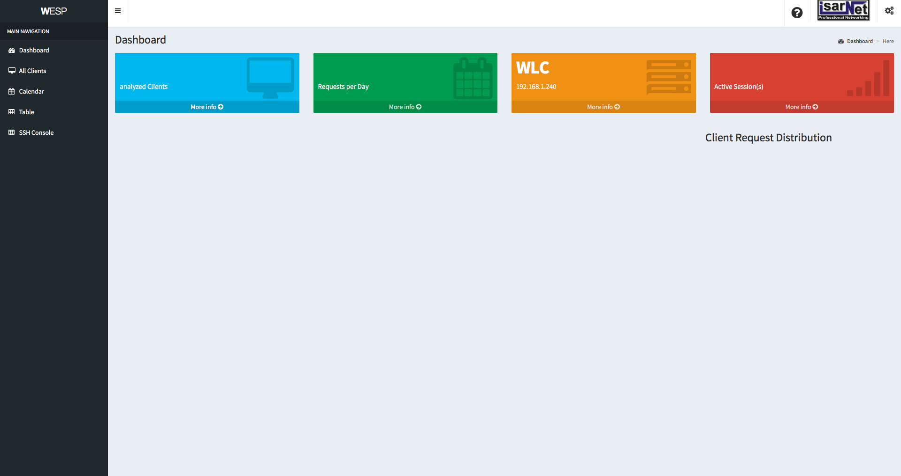
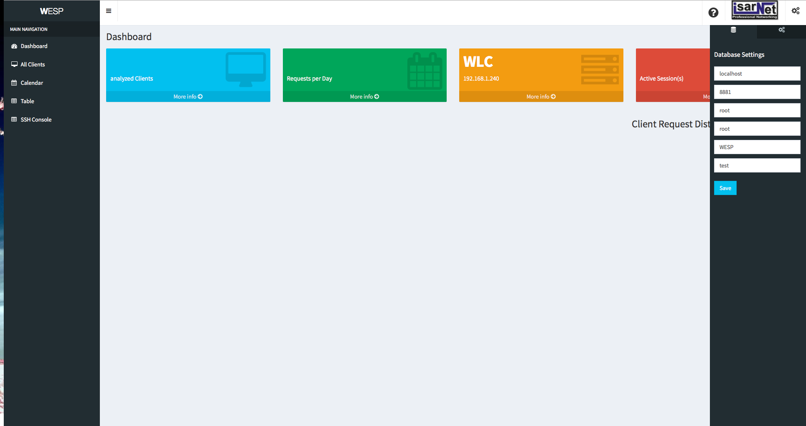
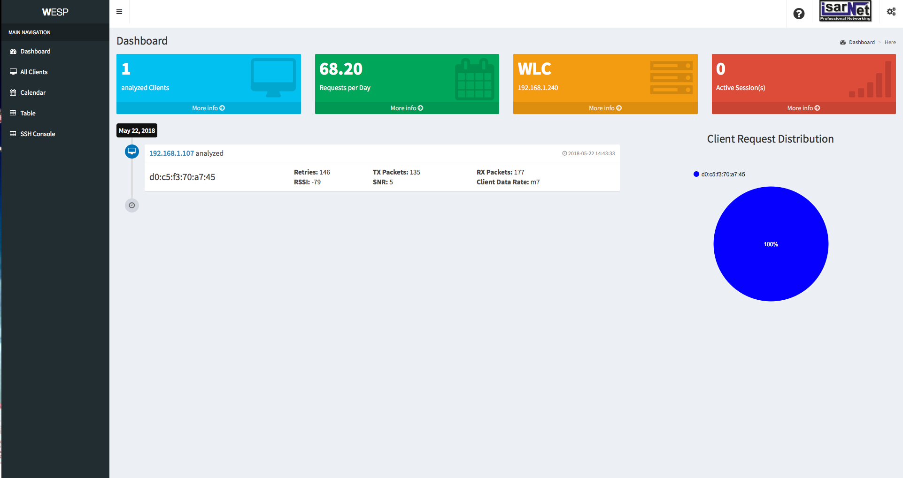

# WESP Web

This web application support the commandline tool WESP, which can be found [here](%https://github.com/IsarNet/wesp). 
The idea behind WESP Web is the simple and elegant visualization of the data, created by WESP CLI. 
Please note that in order to view the diagrams you need an active internet connection. 

## Getting Started


### Prerequisites

To clone this repository git is required:

On RHEL / CentOS systems:
```
sudo yum update && yum install git
```
On Debian / Ubuntu systems:
```
sudo apt-get update && apt-get install git
```
On Mac:
```
brew install git
```
<br />

### Web Server
Make sure you have a web server (e.g. apache) installed. 
Otherwise the website cannot be served. Also ensure that PHP is installed to allow database connections.
Here a few suggestions on how to install a web server on different OSs:

-Ubuntu: [Apache](https://www.digitalocean.com/community/tutorials/how-to-install-the-apache-web-server-on-ubuntu-16-04)

-Debian: [LAMP](https://www.digitalocean.com/community/tutorials/how-to-install-linux-apache-mysql-php-lamp-stack-on-debian)

-macOS: [MAMP](https://www.mamp.info/de/)

-Windows: [XAMPP](https://www.apachefriends.org/de/index.html)

Of course every other web server will do it as well.

<br />

### Installing
Clone repository into the base folder of your server:
```
git clone https://github.com/IsarNet/wesp_web
```

Move everything into the base folder of your server:
```
mv wesp_web/* .
```

Optional: remove the old folder:
```
rm -R wesp_web
```


To use the SSH feature of the website, start the SSH server:
```
cd WebSSH2
```
```
npm start
```

<br />

### Configuration
1. Navigate to your web server using the IP and Port defined in the installation or in the settings of your server. 
For example enter the link into a browser:
```
http://localhost:80/
```

2. You should see a site similar to this (If the site is not reachable check the settings of your web server again):
    

3. Set the connection details to your database, using the sidebar 
(if the connection fails have a look at the troubleshoot section):
 

4. Hit Save and reload the page. If you already have data in your database it should now be displayed, which could look this:
  

5. Also have a look at the other options in the sidebar to change the IP address of your WLC or the column name to identify clients by. 

<br />
<br />

### Troubleshoot
#### No database connection possible, although the credentials are correct.
Ensure the database is reachable by your web server and PHP is installed properly. Also make sure the PHP (/PHP) files are executable and the config files (/PHP/config) are writable. Also check your firewall. 

<br />

#### No clients appear

Check the response of:
```
http://localhost/PHP/listClients.php
```
If the reponse looks something like this:
```
#1 of SELECT list is not in GROUP BY clause and contains nonaggregated column
```
deactivate the mode “ONLY_FULL_GROUP_BY” by sending the following command to your mySQL instance:
```
SET GLOBAL sql_mode=(SELECT REPLACE(@@sql_mode,'ONLY_FULL_GROUP_BY',''));
```

If this did not fix the problem contact the author.

<br />
<br />

## Authors

* **Marcel Rummens** - *Initial work* - [Rummens](https://github.com/Rummens)
 * **Maximilian Tichter** - *Initial work* - [Maxt2266](https://github.com/maxt2266)


See also the list of [contributors](https://github.com/IsarNet/wesp/contributors) who participated in this project.

<br />
<br />

## License

This project is licensed under the GPL-3.0 License - see the [LICENSE.txt](LICENSE.txt) file for details

<br />
<br />
